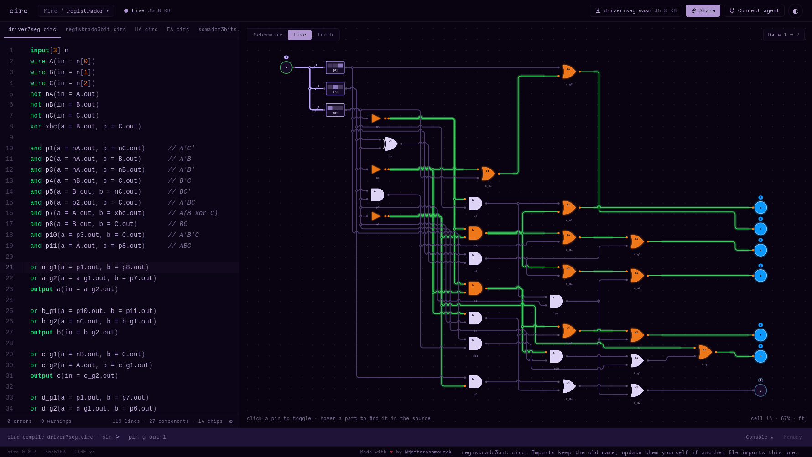

# circ-lang: a linguagem para circuitos lógicos

Repositório de estudos sobre a [circ](https://circ-lang.org/), uma linguagem textual para descrever e simular circuitos lógicos digitais. A ideia aqui é aprender a linguagem na prática, construindo circuitos combinacionais e sequenciais do zero, além de contribuir com o projeto open source por trás dela.

Já imaginou simular os seus próprios circuitos online, sem precisar instalar nada? É basicamente a proposta da circ: escrever o circuito em texto e ver ele rodando no [playground](https://circ-lang.org/playground/) do navegador.

## O que é a circ?

circ é uma linguagem de descrição de hardware (HDL) minimalista, pensada para ser simples de ler e escrever, com portas lógicas, componentes reutilizáveis (`import`), barramentos (`input[n]`) e simulação de clock — o suficiente para modelar desde uma porta lógica isolada até um circuito sequencial com registradores.

- Site oficial: https://circ-lang.org/
- Playground online: https://circ-lang.org/playground/
- Compilador (código-fonte): https://github.com/jeffersonmourak/circ-compiler

## Circuitos deste repositório

| Arquivo | Descrição |
|---|---|
| `HA.circ` | Half Adder (meio somador) — soma dois bits, gera soma e carry |
| `FA.circ` | Full Adder (somador completo) — dois half adders + OR para o carry de saída |
| `somador3bits.circ` | Somador de 3 bits com carry ripple, composto por três `FA` |
| `registrador.circ` | Flip-flop tipo D mestre-escravo, sensível à borda de descida do clock |
| `registrado3bit.circ` | Três registradores de 1 bit combinados, com clock compartilhado |
| `driver7seg.circ` | Decodificador de 3 bits para display de 7 segmentos (dígitos 0 a 7) |
| `main.circ` | Circuito principal: integra somador, registrador e display de 7 segmentos |

O `main.circ` importa e conecta os demais módulos, formando um pequeno somador de 3 bits com registrador e saída em display de 7 segmentos (adaptado de um circuito originalmente feito no Logisim).

## Como testar

Basta abrir o [playground da circ](https://circ-lang.org/playground/) e colar o conteúdo de qualquer um dos arquivos `.circ` para simular o circuito diretamente no navegador.

## Agradecimentos

Um agradecimento ao [Jefferson Mourak](https://github.com/jeffersonmourak), criador da circ-lang, por desenvolver essa linguagem e disponibilizá-la como projeto open source, tornando possível aprender lógica digital de um jeito simples e acessível.

## Licença

Este repositório utiliza a licença presente no arquivo [LICENSE](./LICENSE).
